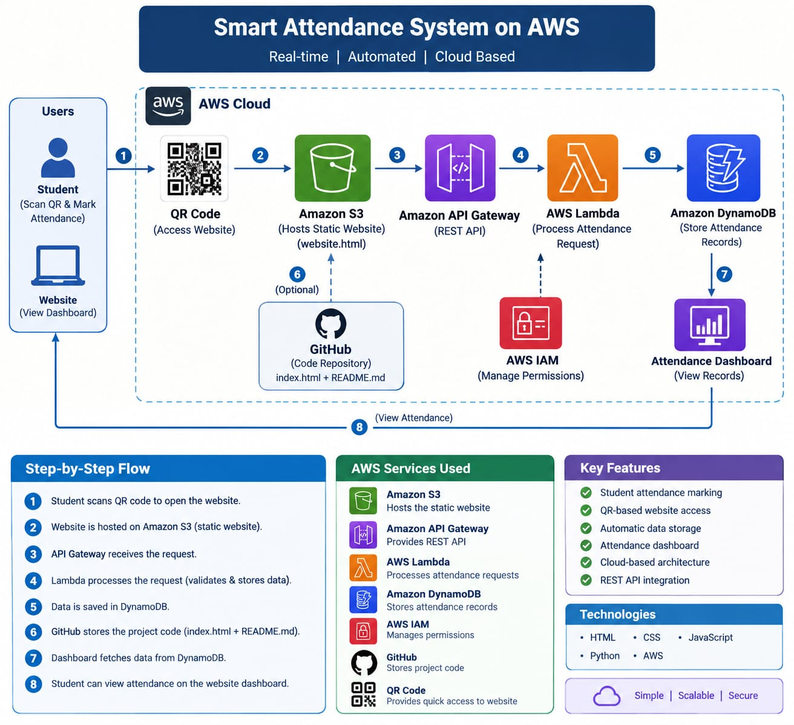

# Smart Attendance System on AWS

## Project Overview

Smart Attendance System is a cloud-based attendance application developed using Amazon Web Services (AWS).

The system allows students to mark their attendance through a web interface. The attendance request is processed using Amazon API Gateway and AWS Lambda, and the attendance data is stored in Amazon DynamoDB.

An attendance dashboard displays the stored attendance records.

## Objective

The main objective of this project is to develop a simple cloud-based attendance system that demonstrates the integration of different AWS services.

## AWS Services Used

- Amazon S3 – Hosts the static website
- Amazon API Gateway – Provides REST API endpoints
- AWS Lambda – Processes attendance requests
- Amazon DynamoDB – Stores attendance records
- AWS IAM – Manages permissions
- GitHub – Stores project source code
- QR Code – Provides quick access to the website

## Architecture

### Project Flow

QR Code  
↓  
S3 Static Website  
↓  
API Gateway  
↓  
AWS Lambda  
↓  
DynamoDB  
↓  
Attendance Dashboard

## Features

- Student attendance marking
- QR-based website access
- Automatic attendance data storage
- Attendance dashboard
- REST API integration
- Cloud-based architecture

## Technologies Used

- HTML
- CSS
- JavaScript
- Python
- AWS

## Screenshots

### Attendance Marked

### Attendance Dashboard

### DynamoDB Attendance Data

### Lambda Attendance Function

### API Gateway

### QR Code

### Dashboard Lambda

### S3 Static Website

## Project Outcome

The project demonstrates how AWS cloud services can be integrated to build a simple and automated attendance management system.

The system successfully accepts attendance through a web interface, processes the request using AWS Lambda, stores the data in DynamoDB, and displays attendance records through a dashboard.
